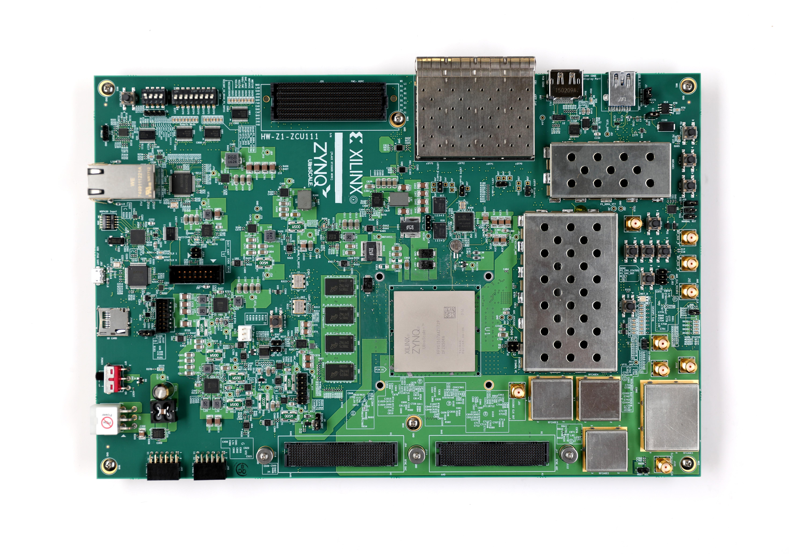
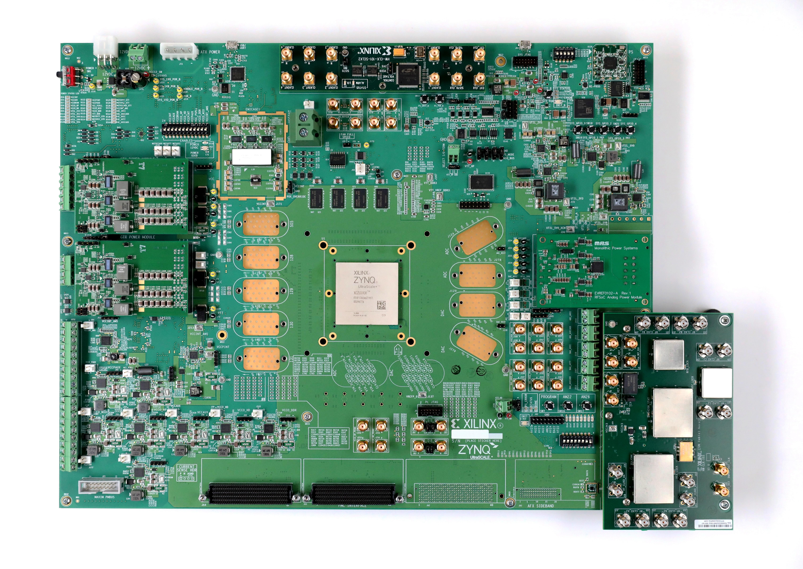
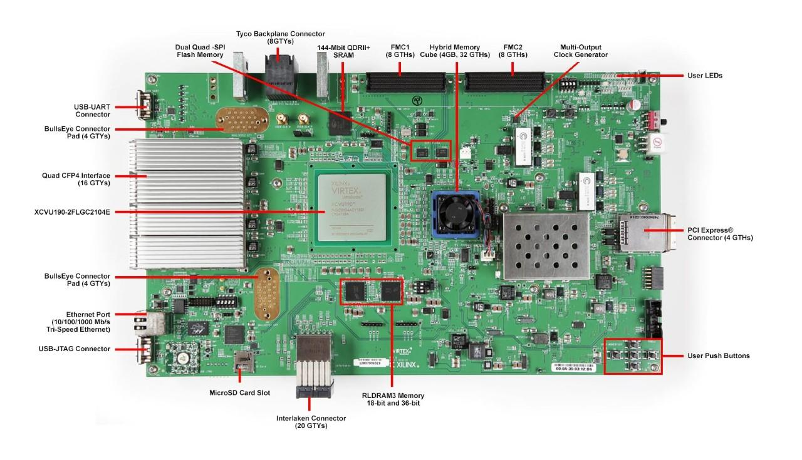
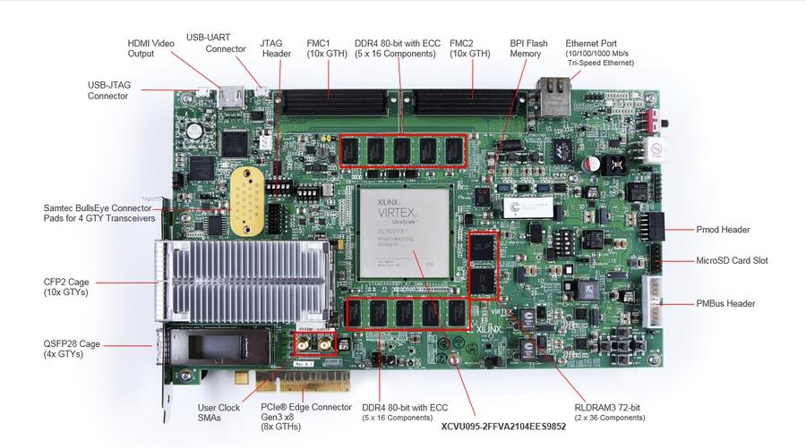

## FPGA开发板需求
1. 满足光纤速率为25 Gbps
2. FPGA资源量可以满足本项目的设计需求

## Xilinx 高速串行收发器
Gigabit Transceiver（GTx），包括GTP、GTR、GTX、GTH、GTZ、GTY、GTM（传输速率不断增加）等，不同系列的FPGA集成的GTx不同，下表为不同系列FPGA集成GTx及性能。

因此支持传输速率25Gbps的高速串行收发器要在Virtex-7和UltraScale架构中选择。

## FPGA板卡调研
1. Virtex-7系列
   
   1. [VC707](https://www.xilinx.com/products/boards-and-kits/ek-v7-vc707-g.html)
   
   1. [VC709](https://www.xilinx.com/products/boards-and-kits/dk-v7-vc709-g.html)
    
Virtex 7系列的主流板卡，均无GTZ，不适合本项目的验证。
2. UltraScale系列
   
   1. [VCU1525](https://www.xilinx.com/products/boards-and-kits/vcu1525-a.html)
   
   2. [VCU118](https://www.xilinx.com/products/boards-and-kits/vcu118.html)
   
   3. [KCU116](https://www.xilinx.com/products/boards-and-kits/ek-u1-kcu116-g.html)
   
   4. [ZCU111](https://www.xilinx.com/products/boards-and-kits/zcu111.html)
   
   5. [zcu1275](https://www.xilinx.com/zcu1275)
   
   6. [zcu1285](https://www.xilinx.com/products/boards-and-kits/zcu1285.html)
   
   7. [vcu110](https://www.xilinx.com/products/boards-and-kits/dk-u1-vcu110-g.html)
   
   8. [vcu108](https://www.xilinx.com/products/boards-and-kits/ek-u1-vcu108-g.html)
   
目前UltraScale的开发板的高速串行收发器都是光口，不适合作为BERT配合AIO开发板适配使用。

## 结论
1. xilinx开发板不适合作为BERT配合AIO开发板使用，
2. 购买一块VC707作为项目调试使用。

## 参考资料
1. [High Speed Transceiver Debugging
NMI FPGA Network](https://nmi.org.uk/wp-content/uploads/2015/06/Xilinx-Transceiver-Debug-2015_V2-1.pdf)
2. [Maximising Serial Bandwidth
And Signal Integrity In FPGAs](https://www.keysight.com/upload/cmc_upload/All/Xilinx_Maximising_SerilBandwidthAndSignaIntegrityInFPGAs.pdf)
3. [The Do’s and Don’ts of
High Speed Serial Design in FPGAs](https://www.keysight.com/upload/cmc_upload/All/5XilinxTheDos.pdf)
4. [xilinx](https://www.xilinx.com/products/boards-and-kits)